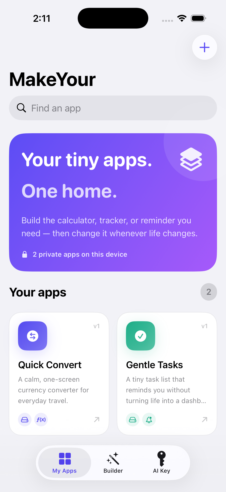
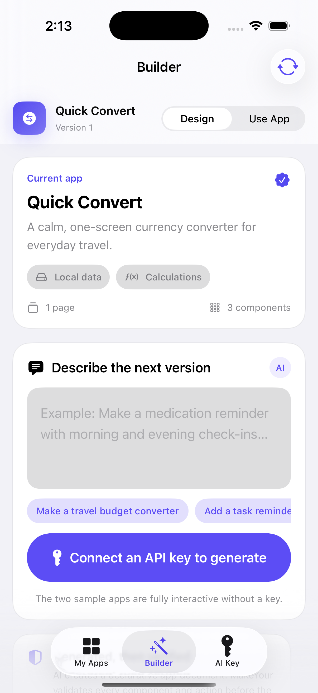
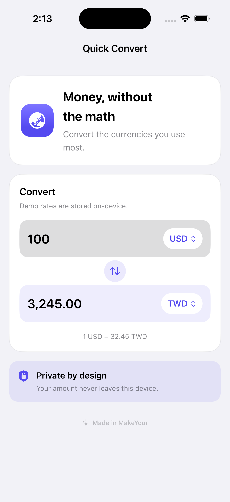
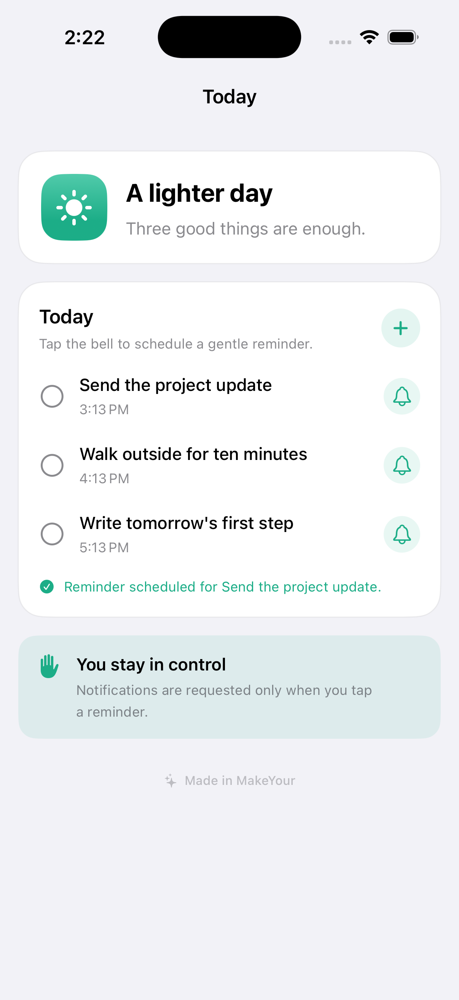

# MakeYour

MakeYour is a personal app runtime for iPhone. Describe a small app, connect your
own AI API key, and get a usable native mini app inside MakeYour — without
rebuilding the same calculator, tracker, checklist, or reminder app from scratch.

The host app never downloads or executes generated Swift code. The model produces
a versioned, declarative `AppDocument`; MakeYour validates that document and
renders it with a catalog of precompiled SwiftUI components and capabilities.

## Demo flow

1. Open **My Apps** and switch between working examples for composable state and
   calculations, a rule-driven original game, live news, market quotes, personal
   accounting, a platform game, Snake, camera/QR capture, foreign exchange,
   task reminders, private photos, and reviewed AI.
2. Open **Builder**, choose **Full app** to create features or **Design only** to
   restyle an existing tiny app without changing its behavior, then review the
   generated result before applying it.
3. Open **Design Studio** for an instant, no-key-required workflow: try a preset,
   tune brand colors, type scale, layout, controls, motion, icon, and a private
   canvas photo, then apply the complete design as one undoable app version.
4. Open **AI Key**, add an OpenAI API key, and generate a real document with the
   Responses API. The key is stored in the device Keychain and requests go from
   the device directly to OpenAI.
5. Add an AI assistant to a mini app. Each request has a review sheet showing
   the exact task and text before anything is sent.

The sample apps work without an API key so reviewers can explore the runtime
immediately.

## Screens

| App library | AI builder |
| --- | --- |
|  |  |

| Currency mini app | Task + notify mini app |
| --- | --- |
|  |  |

## Build

Requirements: Xcode 26.6+ and [XcodeGen](https://github.com/yonaskolb/XcodeGen).

```bash
xcodegen generate
xcodebuild \
  -project MakeYourIOS.xcodeproj \
  -scheme MakeYourIOS \
  -destination 'platform=iOS Simulator,name=iPhone 17 Pro' \
  build
```

Run tests:

```bash
xcodebuild \
  -project MakeYourIOS.xcodeproj \
  -scheme MakeYourIOS \
  -destination 'platform=iOS Simulator,name=iPhone 17 Pro' \
  test
```

The test suite covers schema strictness, capability derivation, document
validation, fixed-provider parsers, persistence calculations, and deterministic
game engines. Run it with the command above before shipping.

The live AI path is intentionally isolated from the normal test suite because it
uses the API key already saved in the selected Simulator and makes one real
OpenAI request:

```bash
xcodebuild \
  -project MakeYourIOS.xcodeproj \
  -scheme MakeYourIOSLiveE2E \
  -destination 'platform=iOS Simulator,name=iPhone 17 Pro' \
  test
```

On July 18, 2026, the current source passed 155 unit tests, six focused runtime
UI paths, the Design Studio UI paths (including Accessibility Extra Extra Extra
Large), the gated live GPT-5.6 generation UI test, strict SwiftLint across 128
Swift files with zero violations, a generic Simulator build, and a signed generic
iOS build. The live test creates, opens, and operates a validated stateful app;
do not run that scheme repeatedly unless another billable end-to-end request is
intended.

## Architecture

```text
Natural-language request
        ↓
OpenAI Responses API + strict JSON schema
        ↓
AppDocument validator + bounded logic/game compilers (untrusted input boundary)
        ↓
Design Genome v2 + SwiftUI component runtime + capability broker
        ↓
Per-project state, private images, and local persistence
```

## Design and media

Generated apps are not forced through one card template. Design Genome v2 gives
each tiny app a semantic light/dark brand palette; type scale and title weight;
canvas, surface, elevation, stroke, control-shape, and motion tokens; four real
page compositions; multiple navigation styles; and renderer-compatible variants
such as editorial, split, full-bleed, framed, cards, dense, and immersive.
`RendererCatalog` rejects variants that a component cannot actually render.

The same design can be created manually in Design Studio or generated with the
Builder's Design-only mode. Design-only output is merged through a host-owned
boundary that preserves pages, component IDs, copy, values, actions, bindings,
data configuration, capabilities, and local media slots. Only the visual genome
is allowed to change.

An image component or canvas background represents a semantic slot such as
`journal-photo` or `design-canvas-background`, never a file path. The user fills
that slot with `PhotosPicker`; MakeYour normalizes the image, stores it in the
project-local asset store, and keeps the bytes outside the generated document
and AI prompt. Media metadata can safely describe role, focal point, mask,
overlay, aspect, and content mode without exposing the underlying asset.

Device features use the same bounded capability model. A generated document may
request host-owned camera, QR/barcode/text scanner, one-time location, Apple
contact picker, bounded text-file import, today’s pedometer count, share sheet,
clipboard write, or haptic components. Access starts only after the user taps;
captured results stay in that tiny app by default, scanned URLs are shown as text
rather than opened, and unsupported simulators or devices receive an honest
fallback. Sharing leaves the app only through the system share sheet after the
user chooses a destination; clipboard writes also require an explicit tap.

## Composable runtime blocks

Generated tiny apps are no longer limited to choosing a prebuilt card or one
hard-coded vertical feature. The declarative runtime now includes typed text,
number, and boolean state; session or per-project persistence; text/number input,
pickers, toggles, sliders, steppers, progress, dynamic text/metrics/banners and
buttons; ordered tap/value-change events; finite arithmetic and conditions;
navigation, alerts, local reminders, and haptics. State templates let several
native views share one value without downloading or executing code.

Games use a separate bounded Tiny Game Program v2: deterministic fixed-step
worlds, visual entity templates, spawns, touch controls, variables, timer/contact/
boundary rules, ordered effects, HUD, win/loss, pause, and restart. The polished
Snake and platformer presets remain available, while custom programs cover
original top-down collectors, dodgers, and simple shooters. Every custom program
is compiled and budget-checked before the runtime accepts it.

## AI inside generated apps

Mini apps can include an allowlisted `aiAssistant` component. The component has
a focused task and accepts only text the user explicitly enters. Before every
request, MakeYour shows the exact task and text for review. Photos, task lists,
other fields, other projects, and the full `AppDocument` are not attached. The
request uses the user's Keychain-backed API key directly with the OpenAI
Responses API.

See [docs/DESIGN_SYSTEM.md](docs/DESIGN_SYSTEM.md) for the complete Design
Genome v2 contract, [docs/ARCHITECTURE.md](docs/ARCHITECTURE.md) for the product boundary,
[docs/RUNTIME_BLOCKS.md](docs/RUNTIME_BLOCKS.md) for the composable behavior and
game vocabulary,
[docs/CAPABILITY_CATALOG.md](docs/CAPABILITY_CATALOG.md) for the exact shipping
capabilities and hardware-limited roadmap, and
[docs/DEVPOST_SUBMISSION.md](docs/DEVPOST_SUBMISSION.md) for the OpenAI Build
Week submission draft and demo storyboard.

App Store Connect metadata, review notes, privacy/support pages, export options,
and the release checklist live in [docs/app-store](docs/app-store).

## Privacy and safety

- API keys are stored with `kSecAttrAccessibleWhenUnlockedThisDeviceOnly`.
- Keys are never written to project files, `UserDefaults`, logs, or generated
  documents.
- Generated documents are size-limited and validated against an allowlist.
- The runtime exposes local UI, calculations, fixed-provider news/market data,
  project data, selected or captured photos, user-initiated scanning, opt-in
  local notifications, deterministic games, and reviewed text-only AI requests.
  It does not execute Swift, JavaScript, WebAssembly, or plugins.
- Mini apps are private workspaces inside one signed host app; they are not
  independent `.ipa` files.
